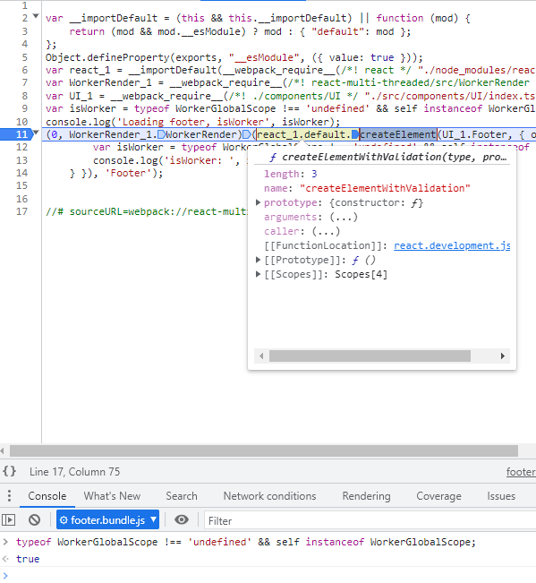

<h1 align="center">
  React-hooks Multi-Threaded

  (multipe channels, hooks implementation)
</h1>
<p align="center">
  create FAST multi-threaded React Apps - one App multi-threads (multipe channel)
</p>

## What is "React-hooks Multi-Threaded"

"React-hooks Multi-Threaded" is a (type/java)script framework that lets you transform your existing/new React-App from a single-threaded Web-App into a multi-threaded faster Web-App.

## Keywords

- [Webpack 5](https://webpack.js.org/)
- [Typescript](https://www.typescriptlang.org/)
- Worker
- [@emotion](https://emotion.sh/)
- styled
- threads
- [Hooks](https://reactjs.org/docs/hooks-intro.html)
- [React 18](https://reactjs.org/)

## How does it work?

In "React-hooks Multi-Threaded" we have two different types of components

- UI Component - UI Components are React components or React FunctionComponents that run on the main thread, they run there since dom interactions must come from the main thread.
- Layout/Logic Component - Layout/Logic-Components are components that run on the web-worker thread, they are used for data fetching, business logic, and high-level layouts.  

with "React-hooks Multi-Threaded" you can build your app from a mix of those two types of components and "React-hooks Multi-Threaded" will separate them into 2 threads, one UI thread with your UI Components and one business logic web-worker thread with your Layout/Logic Components

## How do I get started

start by installing the "React-hooks Multi-Threaded" along-side all of the regular react apps dependencies, you can install  "React-hooks Multi-Threaded" with `npm install react-hooks-multi-threaded` or `yarn add react-hooks-multi-threaded` if you are using yarn.  

the next step is to configure your Webpack configuration, we will configure it with two app entry points, one to the main thread and one for the web-worker.  

## webpack.config.js

```js
const path = require("path")

module.exports = {
    mode: "none",
    entry: {
        index: path.join(__dirname, "src", "index.tsx"),
    },
    target: "web",
    mode: "development",
    resolve: {
        extensions: [".ts", ".tsx", ".js"],
        alias: {
            react: path.resolve("./node_modules/react"),
            "react-multi-threaded": path.resolve(__dirname, "../react-multi-threaded"),
            "react-multi-threaded/src": path.resolve(__dirname, "../react-multi-threaded/src"),
        },
    },
    module: {
        rules: [
            {
                test: /\.tsx?$/,
                use: "ts-loader",
                exclude: "/node_modules/",
            },
            {
                enforce: "pre",
                test: /\.js$/,
                loader: "source-map-loader",
            },
        ],
    },
    output: {
        filename: "[name].bundle.js",
        path: path.resolve(__dirname, "public"),
    },
}
```

we also need to create an Html index and initialize our web-worker in it.

## index.html

```html
<!DOCTYPE html>
<html lang="en">

<head>
    <meta charset="UTF-8" />
    <meta name="viewport" content="width=device-width, initial-scale=1.0" />
    <title>DEMO</title>
</head>

<body>
    <div id="main"></div>
    <div id="sub"></div>

    <script src="index.bundle.js"></script>
</body>

</html>
```

now that we got done with the technical stuff, let's move on to some programing!  
we first need to create a basic react-app although with one simple exception - we need to separate our UI components from our layout components

let's start by creating some UI components

Some pages are created/tested with @emotion styling too.

## src/components/UI/Home.tsx

```tsx
import React from "react"
//use - from "react-multi-threaded" if npm-ed
import { WorkerProps, AsUIComponent } from "react-multi-threaded/src"

const home = (props: WorkerProps<{ username: string; logout: () => void }>) => <div>
    <h1>Hello - {props.username}</h1>
    {props.children}
    <button onClick={() => props.logout()}>logout</button>
</div>

export const Home = AsUIComponent(home)
```

## src/components/UI/Login.tsx

```tsx
/** @jsxImportSource @emotion/react */

import { css } from '@emotion/react'

import React, { useContext, useState } from "react"
import { WorkerProps, AsUIComponent } from "react-multi-threaded/src"
import { ThreadContext } from 'react-multi-threaded/src'

const login = (props: WorkerProps<{ login: (username: string, password: string) => void }>) => {
    const [username, setUsername] = useState("")
    const [password, setPassword] = useState("")
    const context = useContext(ThreadContext)

    return <div>
        <div css={css`color:red;`}>Login ({context})</div>

        <input
            type="text"
            onChange={(e) => { console.log(context); setUsername(e.target.value) }}
            placeholder="username"
        />
        <input
            type="text"
            onChange={(e) => setPassword(e.target.value)}
            placeholder="password"
        />
        <button
            onClick={() =>
                props.login(username, password)
            }
        >
            LogIn
        </button>

        {props?.children}
    </div>
}
export const Login = AsUIComponent(login)

```

## src/components/UI/Prompt.tsx

```tsx
import React, { useContext } from "react"
import { ThreadContext, AsUIComponent, WorkerProps } from "react-multi-threaded/src"

const prompt = (props: WorkerProps<{ message: string; onOk: () => void }>) => {
    const context = useContext(ThreadContext)

    return <div>
        <h1>{props.message}</h1>
        {props.children}
        <button onClick={() => {
            console.log(context, 'Prompt onClick') //main
            props.onOk() //worker call
        }}>ok</button>
    </div>
}
export const Prompt = AsUIComponent(prompt)
```

## src/components/UI/Gif.tsx

```tsx
import React from "react"
import { WorkerProps, AsUIComponent } from "react-multi-threaded/src"

export const Gif = AsUIComponent((props: WorkerProps<{ url: string }>) => <div>
    
</div>)

// export default AsUIComponent(Gif)
```

## src/components/UI/Footer.tsx

```tsx
/** @jsxImportSource @emotion/react */

import { css } from '@emotion/react'

import React, { useEffect, useState } from "react"
import { WorkerProps, AsUIComponent } from "react-multi-threaded/src"

console.log('Footer')
const footer = (props: WorkerProps<{ onTimer?: (value: number) => void }>) => {
    const [count, setCount] = useState(0)
    const isWorker = typeof WorkerGlobalScope !== 'undefined' && self instanceof WorkerGlobalScope

    useEffect(() => {
        setTimeout(() => {
            const isWorker = typeof WorkerGlobalScope !== 'undefined' && self instanceof WorkerGlobalScope
            console.log("isWorker: ", isWorker, count + 1) //run in main thread

            setCount(count + 1)

            props?.onTimer(count + 1)
        }, 1000)
    }, [count])

    return <div css={css`font-weight:bold; color:blue;`}>
        Footer ({count})

        <div>isWorker: {isWorker + ''}</div>
        {props.children}
    </div>
}
export const Footer = AsUIComponent(footer)
```

now that we are done with the UI components let's move on to creating some layout components, those components will define our app logic and layout.  

## src/components/Layout/WorkerApp.tsx

```tsx
/** @jsxImportSource @emotion/react */

import { css } from '@emotion/react'

import React, { useContext, useState } from "react"
import { ThreadContext } from 'react-multi-threaded/src'
import { About } from '../UI/About'
import { Footer } from '../UI/Footer'
import { Gif } from "../UI/Gif"
import { Home } from "../UI/Home"
import { Login } from "../UI/Login"
import { Prompt } from "../UI/Prompt"

export const WorkerApp = (props: { className?: string }) => {
    const context = useContext(ThreadContext)

    const [location, setLocation] = useState<"home" | "error" | "login">("login")
    const [name, setName] = useState("")
    return <>
        {location === "home" && <>
            <Home logout={() => setLocation("login")} username={name}>

                <Gif url="https://upload.wikimedia.org/wikipedia/commons/7/78/GRACE_globe_animation.gif" />
                <Gif url="https://upload.wikimedia.org/wikipedia/commons/7/78/GRACE_globe_animation.gif" />
            </Home>
        </>}

        {location === "login" && <>
            <Login
                login={(username, password) => {
                    console.log("Login", context)

                    if (password === "0000") {
                        setName(username)
                        setLocation("home")
                    } else {
                        setLocation("error")
                    }
                }}>

                <About />

            </Login>
        </>}

        {
            location === "error" && (
                <Prompt message={"wrong password"} onOk={() => {
                    console.log("onOK", context) //worker

                    setLocation("login")
                }}>
                    <About />

                    <Gif url="https://upload.wikimedia.org/wikipedia/commons/7/78/GRACE_globe_animation.gif" />
                </Prompt>
            )
        }
    </>
}

```

congrats we finished creating our entire app UI and layout, we now will need to set-up two app entry points for our app, one for the main thread js bundle and one for the web-worker js bundle.  
the main thread index will be called `index.tsx`  

## src/index.ts

```ts
import React, { ReactNode, useEffect, useRef, useState } from "react"
import { render } from "react-dom"
import { createRoot } from 'react-dom/client'
import { UI } from "react-multi-threaded/src"
import { WorkerClient } from "./app.client"
import { FooterClient } from "./footer.client"

const Content = () => {
    return <div>
        <UI>
            <WorkerClient />
            <FooterClient />
        </UI>
        <UI>
            <table><tbody>
                <tr>
                    <td><FooterClient /></td>
                    <td><FooterClient /></td>
                </tr></tbody>
            </table>
        </UI>

    </div>
}

const container = document.getElementById("main")
const root = createRoot(container)

root.render(<Content />) 
```

that's should be it for the main thread index, let's move on to the web-worker thread index.
the web worker index will be called `worker.tsx` in our example  

## src/app.worker.tsx

```tsx
import React from "react"
import { WorkerRender } from "react-multi-threaded/src/WorkerRender"
import { WorkerApp } from "./components/Layout/WorkerApp"

export const WorkerAppChannel = 'WorkerApp'

WorkerRender(<WorkerApp />, WorkerAppChannel)
```

## src/app.client.tsx

```tsx
import React from "react"
import * as Components from "./components/UI"
import { Client, UI } from "react-multi-threaded/src"
import { WorkerAppChannel } from "./app.worker"

export const WorkerClient = () => {
    new Worker(new URL('./app.worker', import.meta.url))

    return <Client components={[...Object.values(Components)]} channel={WorkerAppChannel} />
}
```

and 2nd worker, the footer, `footer.worker.tsx` in our example  

## src/footer.worker.tsx

```tsx
import React from "react"
import { WorkerRender } from "react-multi-threaded/src/WorkerRender"
import { Footer } from "./components/UI"

const isWorker = typeof WorkerGlobalScope !== 'undefined' && self instanceof WorkerGlobalScope
console.log('Loading footer, isWorker', isWorker)

export const FooterChannel = 'Footer'

WorkerRender(<Footer onTimer={v => {
    const isWorker = typeof WorkerGlobalScope !== 'undefined' && self instanceof WorkerGlobalScope

    console.log('isWorker: ', isWorker, v) //run in worker
}}>
</Footer>, FooterChannel)
```

## src/footer.client.tsx

```tsx
import React from "react"
import * as Components from "./components/UI"
import { Client, UI } from "react-multi-threaded/src"
import { FooterChannel } from "./footer.worker"

export const FooterClient = () => {
    new Worker(new URL('./footer.worker', import.meta.url))
    return <Client components={[...Object.values(Components)]} channel={FooterChannel} />
}
```

<b>It is finished, we now have a multi-threaded react app</b>


<p align="center">we can see in the screenshot above that the App component from `App.tsx` is missing in the react dev-tools tree, that is because it is running it on a separate web worker</p>


## Testing the example
Open 3 terminals

in packages/react-multi-threaded folder

```bash
yarn watch
```

in packages/demo folder

```bash
yarn watch
```
and 

```bash
yarn start
```

## Elements creation checks
  

  

## React in worker (React.CreateElement)

  

## Others react + worker  + DOM library

[react-worker-dom](https://github.com/web-perf/react-worker-dom) too old not compatible to latest React.

[react-web-worker](https://github.com/Shopify/quilt/tree/main/packages/react-web-worker) no DOM

[react-worker-components](https://github.com/dai-shi/react-worker-components) with DOM but not compatible with styling engine

[react-worker-render](https://github.com/yiminghe/react-worker-render) using fiber a bit complicated.